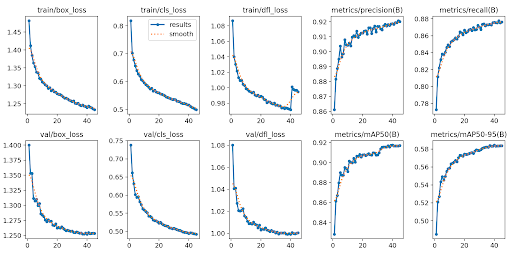

# An AI-shopping assistant for visually impaired and blind people

> 🔗 **Repository:** https://github.com/Soniasanchezquintela/VISTA-ai-research
> (Link also available in the PPT presentation).
> 
"Accessibility is not about convenience; it is about dignity." Improving the shopping experience for visually impaired people.

**Team Members:** Ramon Viedma, Sonia Sánchez, Nuria Olvera, Petros Zonias
**Advisor:** Amanda Duarte

---

## 1. Overview

**Social Motivation/Impact.** For a sighted person, shopping in a supermarket can be a simple 20-minute task. For a
blind or visually impaired person, finding a product on a shelf can require depending on someone else being available
to assist them. This project aims to reduce that dependence. With the VISTA project, we want to give users more autonomy, confidence, and independence in daily shopping tasks. It can also allow shops and retailers to implement social safeguards using AI for Good for groups such as visually impaired people.

**Goal.** VISTA is a prototype assistive system that uses a single camera and the
user's voice to (a) describe the products on a shelf, and (b) tell the user what
product they are pointing at — spoken back in their language.

**End-to-end user story.**
1. The user faces a shelf wearing/holding the camera and speaks a command.
2. The system transcribes the speech and classifies the *intent*
   (e.g. "describe the scene" or "what am I pointing at?").
3. It detects and identifies the products in view, tracks them across frames,
   and resolves which one the finger is pointing at.
4. It speaks back a concise, useful answer.

**Scope of this report.** This report presents the structure of our project, how we built each module, and the results of the experiments we conducted.

### System architecture


We integrated different models to address all the needs of the user. 
1. The product detector works constantly with the CLIP model to identify bounding boxes and assign them to products.
2. As soon as the user wants to interact with the system, they use voice input paired with the intent classifier to request a specific function from the system (describe the scene, identify the pointed-at product).
3. The request goes to the scene memory module, which keeps track of bounding box identities across frames and accounts for head movement or bounding box occlusion due to the pointing hand.
4. The coordinates from the YOLO output are fed into Gemma, which is then able to group them by shelf based on their position.
5. The scene description module then delivers a user-friendly response according to the user request.

| Component | Module | Trained by us? | Status |
|---|---|---|---|
| Product detection | `object_detector/` | ✅ Yes (fine-tuned YOLO) | [Done] |
| Product identification | `object_identifier/` | ❌ No (frozen CLIP, zero-shot) | [Done] |
| Hand & pointing | `hand_detector.py` | ❌ No (pretrained MediaPipe) | [Done] |
| Scene memory / tracking | `scene_memory/` | ❌ No (classical algorithm) | [Done] |
| Voice → intent | `voice/`, `intent_classifier/` | ✅ Yes (fine-tuned DistilBERT) | [Done] |
| Description | `scene_memory/`, [LLM] | ❌ No (prompt-based) | [Done] |

---

## 2. Dataset

### We used 3 datasets, one for each purpose

1. SKU-110k (stock keeping unit): Dataset for object detection in densely packed scenes such as supermarket shelves. We only detect an object (no name, no brand, no category). This was used to fine-tune the YOLO model (not labelled with product names).
2. Web-scraped dataset from the Ametller online shop: This was used to obtain product images from Ametller with labels.
3. We took photos at Ametller, created bounding boxes, and labelled the products in the bounding boxes in order to evaluate the performance of our project.

## 3. How to run the code

### Requirements
- Python **3.10+** (the codebase uses `X | None` type syntax at runtime).
- Linux or macOS, Nvidia GPU for better performance

### Setup
```bash
git clone https://github.com/Soniasanchezquintela/VISTA-ai-research.git
cd VISTA-ai-research
python -m venv .venv && source .venv/bin/activate
pip install -r requirements.txt
```

Under Linux, you might also need to install a few extra packages. We have a helper script for this purpose:
```
$ ./apt_packages.sh
```

### Model files (download separately from this Google Drive [folder](https://drive.google.com/drive/folders/1Looy2jQJs1j0C8SvU6CuQzLTPKX01EGI))
| File | Save in | Size |
|---|---|---|
| `sku110k_768_e20_pat5.pt` (YOLO weights) | `object_detector/` | 39 MB |
| `hand_landmarker.task` (MediaPipe) | project root | 7.5 MB |
| `intent_classifier.pt` (intent model) | `intent_classifier/checkpoints/` | 515 MB |
| `voice_models` (piper-tts voices) | `voice/models` | 341 MB |


### Running
```bash
python project.py --image path/to/shelf.jpg   # single image
python project.py --webcam 0                   # live; type `listen` for a voice command

Case 1 - Image input:
process_image - process_image <image_path>
describe_scene - Describe the current scene

Case 2 - Video input:
listen - activates the module that listens for the user's voice command
describe_scene - describes the products present in the scene
describe_pointed_product - gives the name of the pointed product
```

---

## 4. System components

This section explains **how each part of the system works**, in **pipeline order**.
The system has two layers: a **perception layer that runs continuously** (detection,
identification, pointing), feeding a **scene-memory "brain"** that maintains a stable
picture of the shelf; and a **user-activated layer** (voice → intent) that, on command,
decides what to do with that picture and hands it to the **description** module for a
spoken answer. Section 5 then evaluates these components experimentally.

### 4.1 Always-on perception

These three run on **every frame**, continuously, independent of any user command.
Together they answer *"where are the products, what are they, and is the user
pointing at one?"*

**Product detection — YOLO (`object_detector/`).**
A YOLO11 model, fine-tuned on SKU110K, draws a bounding box around **every product**
on the shelf. It is **class-agnostic**: it answers only *"where are the products?"*,
not *"what are they?"* (a single "product" class). Its boxes feed identification,
pointing, and tracking.

**Product identification — CLIP, image-to-image (`object_identifier/`).**
Each detected box is cropped and passed through a **frozen CLIP image encoder**
(`open_clip` ViT-B-32), producing an embedding — a vector capturing what the crop
looks like. That embedding is compared by **cosine similarity** against pre-computed
embeddings of a catalog of reference product photos; the closest match wins if it
clears a confidence gate (minimum score, plus a margin over the next-best *different*
product, or the same product appearing several times in the top-k). No text or labels
are involved — photo is compared to photo — so it is language-independent and needs no
per-product training. A recognized product is drawn **green**, an unrecognized one red.

**Hand & pointing detection — MediaPipe (`hand_detector.py`).**
A pretrained MediaPipe HandLandmarker locates the hand and extracts the **index-finger
tip**. That point is mapped to a product: if it falls **inside** a box, that box is
selected; otherwise the **nearest** box within a tolerance is chosen. This is what
lets the user select a product by pointing.

*In detail:* the HandLandmarker (`hand_landmarker.task`, float16) runs in image and
video modes and returns 21 hand landmarks; we use the index-finger-tip landmark as the
pointing coordinate. Selection is resolved against the tracked boxes in scene memory
(§4.2), so a product can still be selected even while the hand partially occludes it.
No custom training is involved — the pretrained model is used as-is.

*Demonstration* — the finger tip resolving to the correct product box:


### 4.2 Scene memory — the "brain" (`scene_memory/`)

The perception layer is per-frame and noisy. Scene memory is the component that turns
that raw, flickering output into a **stable, remembered scene** — products keep a
consistent identity across frames, survive brief occlusion, and can be pointed at.
Every action the user requests is answered from this remembered scene, not from a
single raw frame. It combines four mechanisms:

- **IoU matching** — *Intersection over Union* measures how much two boxes overlap
  relative to their combined area (0 = disjoint, 1 = identical). Each frame, a
  remembered product is matched to the new detection it overlaps most; overlap
  **≥ 30%** = same product (keep its ID and history), below 30% = not a match.
- **Product voting** — a single CLIP reading can be wrong. Each tracked product keeps
  a per-identity **vote tally**; every confident frame adds its score, and the label
  shown is whichever identity leads. One bad frame can't override a repeated,
  confident answer; low-confidence frames don't vote.
- **Motion compensation** — a camera pan (head turn) moves every box at once and would
  break every match, leaving "ghost" boxes and renumbering. Since a pan shifts every
  product by the *same* vector, we recover it by **displacement voting** (the shift the
  most products agree on) and move old boxes to their predicted positions before
  matching, so identities survive. Handles translation, not large rotation/zoom.
- **Occlusion persistence** — a product that disappears (e.g. a hand covering it) is
  kept as a greyed "lost" box for ~**90 frames (~3 s)** and revived with its original
  ID if it reappears.

*Why it matters (vs. no tracking):* the original per-frame approach
(`ShelfSceneMemory`) resets every frame — boxes flicker, IDs change constantly, and
pointing is impossible (`get_touched_object()` always returns `None`). Our
`TrackedShelfSceneMemory` is a drop-in replacement (same interface) that fixes all of
this. It is validated by unit tests (`test_scene_memory.py`: ID stability,
occlusion survival/removal, pointing resolution, voting, bbox smoothing) and by
qualitative webcam runs (stable IDs, grey box reviving after a hand passes, no
ghost-box swarm on head turns).

*Demonstration:* [PLACEHOLDER — screenshot of a product keeping its ID while briefly
covered (grey "lost" box → revived), and green boxes once CLIP recognizes a product.]

### 4.3 User interaction — voice & intent (`voice_to_text.py`, `intent_classifier/`)

This layer is **activated by the user** and is what tells the system *what to do* with
the scene the components above have built. When the user speaks, `faster-whisper`
transcribes the audio to text, and a fine-tuned `distilbert-base-multilingual-cased`
classifier maps that text to an **intent** and extracts a **target** product name where
relevant. The intent then routes to an action that consumes the perception + scene-memory
output:

- **"Describe the scene"** → takes the visible products from scene memory (§4.2) and
  passes them to the description module (§4.4).
- **"What am I pointing at?"** → takes the product that the pointing module (§4.1) and scene memory
  resolved as *touched*, and describes that one.
- **"Navigate to \<target\>"** → looks up the target product in scene memory.

So the voice layer does not do any vision itself — it selects which already-computed
result to turn into a spoken answer.

### 4.4 Scene description — final output (`scene_memory/`, LLM)

The last step turns the selected result into the spoken answer. Product **coordinates
from YOLO are fed to Gemma**, which groups products into shelves by their position, and
a natural-language response is generated (grouping duplicate products, counting
unrecognized ones) — then spoken back to the user in their language.

*In detail:* there are two paths. A **templated** path (`describe_scene()` /
`describe_pointed_product()`) that groups identical SKUs and counts unknowns into a
fixed Spanish sentence, and an **LLM** path (Gemma) that takes the products and their
positions and produces a richer, shelf-aware description. The inputs are the visible
tracks from scene memory (for "describe scene") or the single touched track (for
"what am I pointing at?").

*Demonstration* — sample outputs:
- Scene description: [PLACEHOLDER — paste a real example, e.g. *"La escena contiene
  leche de avena Oatly y leche de soja Alpro. Además, hay 2 productos que no
  reconozco."*]
- Pointed product (recognized): [PLACEHOLDER — real example]
- Pointed product (unrecognized): [PLACEHOLDER — the "aparta la mano" fallback message]

---

## 5. Experiments

These are different experiments that we ran in order to find the optimal configuration of our system and determine which modules work best.

> Each subsection: **Hypothesis → Setup → Results → Conclusions.**

---

### Experiment 1 — Fine-tuning a detector for dense shelf products (YOLO / SKU110K)
*Type: neural-network training experiment.*

**Hypothesis**
We expect that fine-tuning YOLO11 on SKU110K (a dataset built specifically for dense retail
shelves) will allow for accurate object detection in a supermarket setting with an mAP@0.5 > 80%. This is used only for drawing bounding boxes around products, not classifying them.

**Experiment setup**
- **Base model:** `yolo11m.pt` (Ultralytics YOLO11-medium).
- **Data:** SKU110K (`sku110k_product.yaml`), a single "product" class of densely
  packed retail items. [State train/val/test counts.]
- **Training config:** `epochs=50`, `patience=5` (early stopping), `imgsz=768`,
  `batch=8`. [Optimizer/LR = Ultralytics defaults unless changed.]
- **Tuning explored:** input size 640 vs 768, batch 8 vs 4 (see throughput notes
  in `train_yolo.py`); the shipped weights are `imgsz=768`, early-stopped (the
  filename `sku110k_768_e20_pat5` reflects ~20 effective epochs, patience 5).
- **Evaluation:** [mAP@0.5 / mAP@0.5:0.95 on SKU110K val] + qualitative results on
  our own Ametller/iPhone shelf photos. Artifacts in `object_detector/train_yolo_results/`.

**Results**
- **mAP@0.5 ≈ 0.92** — at an IoU threshold of 0.50, the detector localizes shelf
  products with high precision/recall.
- **mAP@0.5:0.95 = 0.58** — averaged over stricter IoU thresholds (0.50–0.95),
  the score drops, indicating boxes are found reliably but not always tightly
  aligned to the product edges.
- **Training curves** (below): all training and validation losses (box, cls, dfl)
  decrease smoothly and converge, with no divergence between train and val — no
  sign of overfitting. Precision (~0.92), recall (~0.88), mAP@0.5 (~0.92) and
  mAP@0.5:0.95 (~0.58) all rise and plateau over ~45 epochs.

  

  *Figure 1 — YOLO11 training/validation losses and detection metrics over epochs.*

**Conclusions**
[The hypothesis was validated and the fine-tuned model was used in the project.]

---

### Experiment 2 — Zero-shot product identification with CLIP + a reference catalog
*Type: evaluation / threshold-tuning experiment (no training).*

**Hypothesis**
Rather than training a classifier per product (which doesn't scale as the catalog
grows), we expect a frozen CLIP encoder plus a small catalog of reference images
to identify a cropped product by nearest-neighbour in embedding space — and that
confidence thresholds can suppress wrong guesses on products not in the catalog.

**Prior approach and why we changed**
Our first attempt was **image-to-text**: we fine-tuned the last two layers of a
CLIP model so that a bounding-box crop's image embedding would align with the
**text embedding of the product label**, and identified a product by matching the
crop against those label embeddings. Evaluated over a catalog of **~1000 products**,
this reached **recall@1 ≈ 70%**.

The decisive problem, however, was **not** the aggregate recall figure — it was
that specific products were **consistently, reproducibly mismatched**, not randomly
wrong. Two linked weaknesses drove this:

1. **Language dependency.** Product labels were in Spanish/Catalan, while CLIP's
   text encoder is trained predominantly on English, so labels had to be translated
   to English to match at all — an extra, fragile step in the pipeline.
2. **Weak, coarse text matching even after translation.** Similarity scores stayed
   low (~0.26–0.34) and semantically-adjacent products were reliably confused. For
   example (query shown as `Spanish label → English translation`, then top matches
   with cosine scores):

   ```
   'yogur natural' → 'natural yogurt'
     [0.314] Yogur natural de cabra Hacendado — Postres y yogures
     [0.313] Queso fresco Burgos natural Hacendado — Charcutería y quesos   ← fresh CHEESE, not yogurt
     [0.291] Queso fresco Burgos natural Hacendado — Charcutería y quesos

   'pan de molde' → 'sliced bread'
     [0.337] Barra pan de pueblo rebanada — Panadería y pastelería          ← a baguette-style loaf,
     [0.322] Barra de pan espiga rebanado — Panadería y pastelería             not sandwich bread
     [0.321] Barra de pan campesina masa madre rebanada — Panadería y pastelería
   ```

   The matches are near-ties at low confidence, so the "winner" for these items was
   effectively arbitrary among a cluster of wrong-but-related products.

For an assistive use case, a system that *reliably* fails on specific products is
worse than one that fails randomly: the user learns it "can never find" those items.

We therefore switched to the **image-to-image** method described below: comparing the
crop's image embedding directly to image embeddings of catalog photos. This removes
text — and therefore the translation step and language dependency — from the pipeline
entirely, and compares like-with-like (photo vs photo) instead of photo vs label. It
is also zero-shot (no fine-tuning) and scales simply by adding more reference images.

**Experiment setup**
- **Catalog:** ~**52 SKUs** (54 reference images, milks and plant-based drinks
  scraped from Ametller); embeddings precomputed in `product_db/embeddings/`,
  metadata in `metadata.csv` / `products.sqlite`.
- **Matching:** cosine similarity of the crop embedding vs catalog embeddings;
  accept if `score ≥ 0.70` and a margin/consensus check passes (margin ≥ 0.02 over
  the next different SKU, or the same SKU appears ≥2× in the top-k).
- **Encoders compared (A/B):**
  - `open_clip` ViT-B-32 (laion2b), frozen — the generic model in use.
  - a **CLIP fine-tuned on ~1000 Mercadona products** (our earlier image-to-text
    model), reused here as an **image encoder only**.
- **Evaluation, two modes** on our **own labelled iPhone shelf dataset** (485 boxes,
  hand-labelled with true SKU):
  1. *Full pipeline* (`metrics.py`): YOLO detection → identify → accept gate → compare.
  2. *Encoder-only recall@1*: crop each **ground-truth** box, take the nearest catalog
     image — isolates encoder quality from detection and the accept gate.

**Results**
- **Full pipeline** (`metrics.py`, 27 images / 485 boxes): detection F1 ≈ **0.80**;
  identification **precision ≈ recall ≈ 0.48**. Of 385 correctly-detected boxes:
  232 correct, 68 wrong SKU, **85 rejected** by the accept gate.
- **Encoder-only recall@1** (ground-truth boxes, no accept gate):
  - `open_clip` (generic): **68.5%**
  - Mercadona fine-tuned: **64.7%**
- Prior image-to-text approach: recall@1 ≈ 70% on a different ~1000-product **text**
  catalog — not directly comparable (see note below).
- Worst products (both encoders): size/variant look-alikes — e.g. `oatly_avena_500ml`,
  `yosoy_avena_250ml`, `cacaolat_sinazucar`, `ametller_llet_semidesnatada`.

> **Note on the prior method.** The switch from image-to-text to image-to-image was
> **not** for higher recall — it was for robustness: image-to-text failed
> *systematically* on specific products due to a language dependency (Spanish/Catalan
> labels vs an English-trained text encoder), whereas image-to-image removes text
> entirely.

**Conclusions**
1. **The fine-tuned encoder does not help.** Fine-tuning was done for image-to-**text**
   alignment and gives *slightly worse* image-to-**image** recall (64.7% vs 68.5%), so
   we keep the generic `open_clip` encoder.
2. **The encoder is not the bottleneck — the acceptance gate is.** Encoder recall@1 is
   ~68% but the full pipeline scores ~48%; the ~20-point gap is the accept gate
   rejecting correct matches (85 rejections). With ~1 reference image per SKU the
   consensus path is effectively dead and acceptance leans on a tiny margin between
   look-alikes. Relaxing the gate / adding reference images is the highest-value fix.
3. **Remaining errors are a catalog problem, not a model problem.** Both encoders fail
   on the same size/variant look-alikes, which more reference images per SKU (and
   size-aware cues) would address — not a different model.

---

### Experiment 3 — Voice command understanding (Whisper STT + intent classifier)
*Type: neural-network training experiment (the intent classifier is fine-tuned).*

**Hypothesis**
We expect that off-the-shelf speech-to-text plus a fine-tuned multilingual intent
classifier can map spoken commands (Spanish/Catalan) to the correct action, and
that fine-tuning a compact transformer on a small hand-built intent dataset is
enough for the limited command vocabulary of this application.

**Experiment setup**
- **STT:** `faster-whisper` (base model, Spanish), via `voice_to_text.py`.
- **Intent model:** `distilbert-base-multilingual-cased` encoder + MLP head
  (`hidden_size=256`, `dropout=0.2`), fine-tuned with AdamW, `max_length=64`, a
  validation split, and a confidence threshold that falls back to `unknown`.
- **Data:** `intent_classifier/data/intents.csv` — ~**202** labelled commands
  across **7** intents (describe_scene, describe_pointed_product,
  navigate_to_target, confirm_target_present, get_price, read_text, unknown),
  plus rule-based target extraction.
- **Evaluation:** [validation accuracy per intent; target-extraction accuracy;
  end-to-end voice→intent on live mic samples].

**Results**
- [PLACEHOLDER — validation accuracy + per-intent confusion matrix.]
- [PLACEHOLDER — training/val accuracy curve from `checkpoints/`.]
- [PLACEHOLDER — end-to-end examples: spoken phrase → transcription → intent.]

**Conclusions**
[Which intents are reliable vs confused (small dataset risk); how STT errors
cascade into wrong intents; whether 202 examples / 7 classes is enough or the
dataset needs expansion; Spanish vs Catalan coverage. New hypotheses.]

---

## ❇️ 6. Overall conclusions & future work

[Synthesize across experiments: what works end-to-end today, the weakest link
(e.g. the 10-SKU catalog limiting identification), most promising next steps,
tie back to the assistive use case.]
🚀 Overall, this multi-modal approach to support the visually impaired works and shows
a lot of potential. 
💡 We have learned that the system needs more than frame-by-frame AI; it needs memory,
confidence, tracking, and user-centered interaction. 
⚒️ What we would do differently: collect realistic video data earlier, design the scene
memory layer from the start, modularize the pipeline more clearly, work on robustness,
and evaluate sooner. 

Next steps could include:
🛍️ Increase the supermarket dataset to have more images and a more diverse set
of contexts within the supermarket (e.g., product type, arrangement, light, access).
👩‍✈️ Pilot the project with visually impaired people.

---

## 7. References

[Format consistently — e.g. numbered or author-year. Pull the related papers from
`papers.md`. Suggested entries:]

**Datasets**
- [SKU110K — Goldman et al., "Precise Detection in Densely Packed Scenes," CVPR 2019.]

**Models & libraries**
- [Ultralytics YOLO11 — detection.]
- [OpenCLIP / CLIP — Radford et al., "Learning Transferable Visual Models From
  Natural Language Supervision," 2021; open_clip ViT-B-32 (laion2b).]
- [MediaPipe Hands / HandLandmarker — Google.]
- [faster-whisper (CTranslate2) — Whisper, Radford et al., 2022.]
- [DistilBERT — Sanh et al., 2019; `distilbert-base-multilingual-cased`.]
- [Multi-object tracking background (IoU/SORT) — Bewley et al., 2016 — for the
  scene-memory section's future-work discussion.]

**Related work**
- [The 1–3 papers listed in `papers.md` that motivated the assistive use case.]

---

<!-- APPENDIX (optional) -->
## Appendix [optional]

- [Per-experiment extra figures, full hyperparameter tables, additional sample outputs.]
- [Link to slides — note: slides are a separate deliverable and do NOT count as the report.]
- Deeper dive on scene memory internals: see [`SCENE_MEMORY_EXPLAINED.md`](SCENE_MEMORY_EXPLAINED.md).
